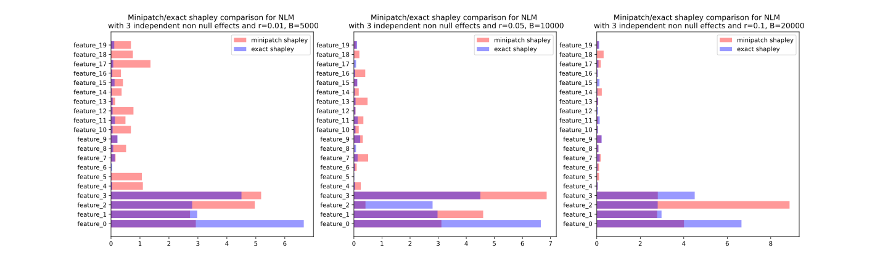

# Minipatch Shapley values

Efficient Shapley computation with Minipatches
- Code under `shapley_compute` folder
- Notebook `Exp_SimulatedRegressions` for regression experiments
   
  Figure with $n = 10000$
- Notebook `Exp_CaliforniaHousingDataset` for regression on toy dataset
  
